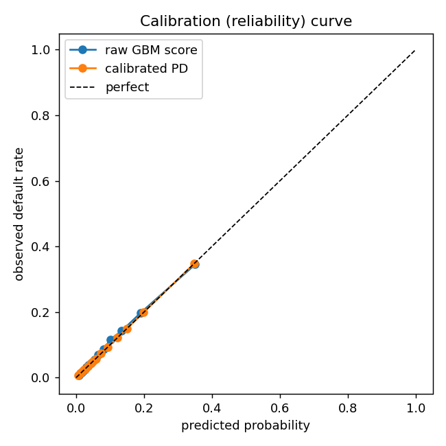
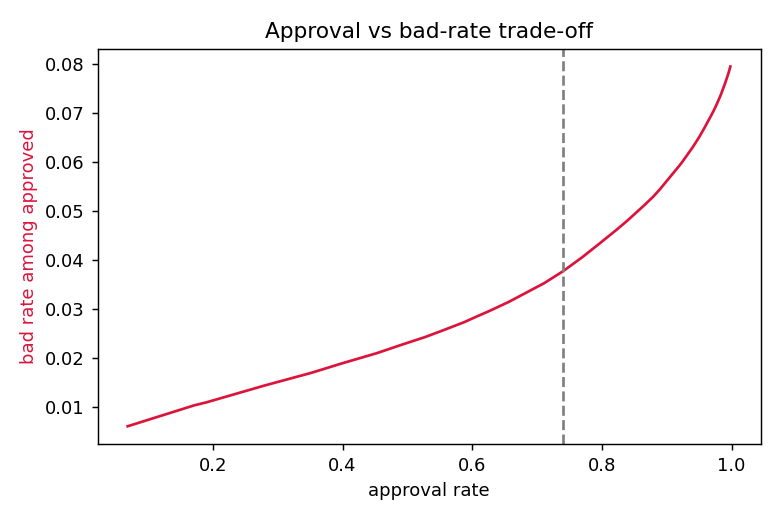

# Results

_Out-of-fold, measured on real data._

| Metric | Value |
|---|---|
| AUC | 0.7884 |
| Gini | 0.5767 |
| KS | 0.4360 |
| Brier (calibrated) | 0.0658 |
| Default rate (base) | 0.0807 |
| N applicants | 307,511 |

